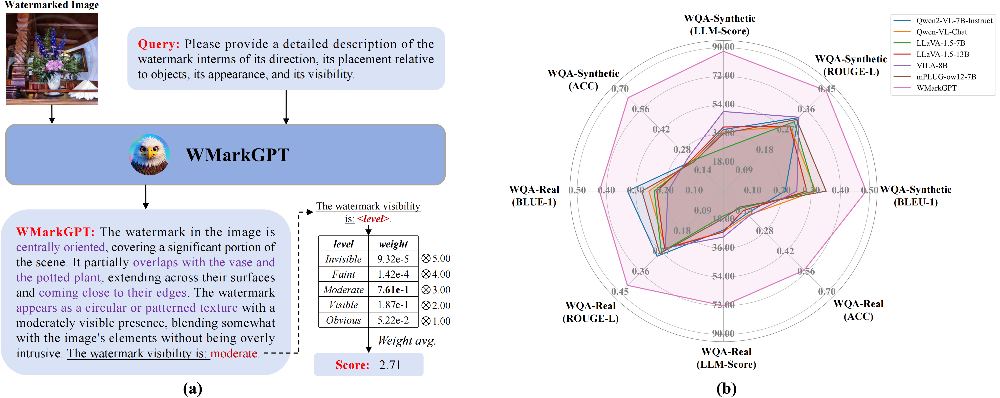

# WMarkGPT: Watermarked Image Understanding via Multimodal Large Language Models

\[[Paper](https://openreview.net/pdf?id=HjVhSL76GM)\] \[[Project](https://huggingface.co/TanSongBai/WMarkGPT-Synthetic)\]



## News

- \[2025/04\] 🔥 Our WMarkGPT paper has been accepted at ICML 2025!

## Abstract
Invisible watermarking is widely used to protect digital images from unauthorized use. Accurate assessment of watermarking efficacy is crucial for advancing algorithmic development. However, existing statistical metrics, such as PSNR, rely on access to original images, which are often unavailable in text-driven generative watermarking and fail to capture critical aspects of watermarking, particularly visibility. More importantly, these metrics fail to account for potential corruption of image content. To address these limitations, we propose WMarkGPT, the first multimodal large language model (MLLM) specifically designed for comprehensive watermarked image understanding, without accessing original images. WMarkGPT not only predicts watermark visibility but also generates detailed textual descriptions of its location, content, and impact on image semantics, enabling a more nuanced interpretation of watermarked images. Tackling the challenge of precise location description and understanding images with vastly different content, we construct three visual question-answering (VQA) datasets: an object location-aware dataset, a synthetic watermarking dataset, and a real watermarking dataset. We introduce a meticulously designed three-stage learning pipeline to progressively equip WMarkGPT with the necessary abilities. Extensive experiments on synthetic and real watermarking QA datasets demonstrate that WMarkGPT outperforms existing MLLMs, achieving significant improvements in visibility prediction and content description. The datasets and code will be made publicly available. More details are included in the appendix.

## ⚙ Setup

Download the repo:

```bash
git clone https://github.com/TanSongBai/WMarkGPT.git
cd WMarkGPT
conda create -n wmarkgpt python=3.8
conda activate wmarkgpt
pip install -r requirements.txt
```

## 🚀 Checkpoint&Dataset
- Our **WMarkGPT inference model** is now available for public access. You can download the inference model at **[WMarkGPT-Synthetic](https://huggingface.co/TanSongBai/WMarkGPT-Synthetic)** and **[WMarkGPT-Real](https://huggingface.co/TanSongBai/WMarkGPT-Real)**.
- The three visual question-answering (VQA) dataset we constructed can be downloaded from **[Google Drive](https://drive.google.com/drive/folders/1JoRq91b0UAbTU4SEblCycRVwCpUgkeg2)**. Then place the downloaded dataset on "./playground".


## 🔨 Quick Start

**Evaluate an single image:**
```bash
python evaluate/demo.py --image_file images/000000495680_0.21.png --model_path TanSongBai/WMarkGPT-Synthetic
```
**Evaluate in a batch:**
```bash
python evaluate/eva.py --image_dir playground/WQA-Synthetic/stego --image_file playground/WQA-Synthetic/test.json --save_dir result/WQA-Synthetic/out --model_path TanSongBai/WMarkGPT-Synthetic
```
**Rate watermarked images:**
```bash
python evaluate/iqa_eval.py --model-path TanSongBai/WMarkGPT-Synthetic --text_dir result/WQA-Synthetic/out --data_dir playground/WQA-Synthetic/stego --json_path playground/WQA-Synthetic/test.json --save_path result/WQA-Synthetic/wmarkgpt_qscore.json
```

## 📃Citation

```
@article{tanwmarkgpt,
  title={WMarkGPT: Watermarked Image Understanding via Multimodal Large Language Models},
  author={Tan, Songbai and Qiu, Xuerui and Shu, Yao and Xu, Gang and Xu, Linrui and Xu, Xiangyu and Zhuang, Huiping and Li, Ming and Yu, Fei}
}
```